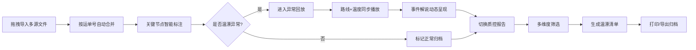

# 冷链质控路线温漂复盘系统 - 产品需求文档

## 1. 产品概述

面向冷链质控主管的桌面端复盘工具，用于每日收车后对运输全程进行温度偏移分析，快速定位问题线路、司机和货物类型。通过多源数据融合（温度记录、GPS轨迹、装卸时间）还原运输真相，为周会追责和供应商考核提供数据支撑。

- 核心目标：将分散的温度、位置、时间数据整合为可追溯的温度事件链
- 目标用户：冷链物流质控主管、运营经理
- 产品价值：缩短温漂问题溯源时间 80%，实现有据可依的责任认定

## 2. 核心功能

### 2.1 用户角色

| 角色 | 登录方式 | 核心权限 |
|------|----------|----------|
| 质控主管 | 本地账号 | 数据导入、异常回放、报告生成与打印 |

### 2.2 功能模块

1. **导入运单窗口**：文件拖拽区、运单列表、时间轴节点标注
2. **异常回放窗口**：路线地图、温度曲线、播放控制、事件解说
3. **质控报告窗口**：多维度筛选、温漂清单表格、打印导出

### 2.3 页面详情

| 页面名称 | 模块名称 | 功能描述 |
|----------|----------|----------|
| 导入运单窗口 | 文件拖拽区 | 支持温度记录（.csv/.txt）、GPS轨迹（.gpx/.csv）、装卸记录（.csv）拖拽上传，自动按运单号匹配合并 |
| 导入运单窗口 | 运单数据列表 | 展示已导入运单（运单号、司机、线路、承运商、门店、货物类型、温漂状态） |
| 导入运单窗口 | 关键节点标注 | 自动识别并标记：装货等待、途中停车、临近卸货排队等时间节点 |
| 异常回放窗口 | 路线地图视图 | SVG路线图，随播放进度显示车辆当前位置及途经点 |
| 异常回放窗口 | 温度变化曲线 | 实时绘制温度折线图，超温区域红色高亮，标注阈值线 |
| 异常回放窗口 | 播放控制栏 | 播放/暂停、倍速（1x/2x/4x）、进度拖拽跳转、时间显示 |
| 异常回放窗口 | 事件说明面板 | 动态文字解说，如"高速服务区停靠42分钟后开始缓慢升温" |
| 质控报告窗口 | 筛选条件区 | 按门店、线路、承运商、司机、货物类型、日期范围筛选 |
| 质控报告窗口 | 温漂清单表格 | 超温时长、最高温度、发生时段、责任环节、改进建议列 |
| 质控报告窗口 | 打印预览与导出 | A4打印布局、一键导出PDF/打印 |

## 3. 核心流程

质控主管每日收车后登录系统 → 将当日所有温度/GPS/装卸文件拖拽至导入区 → 系统自动合并匹配运单并标注关键节点 → 选择异常运单进入回放 → 沿路线逐分钟查看温度变化与事件说明 → 切换至报告页筛选维度 → 生成温漂清单并打印用于周会

## 4. 用户界面设计

### 4.1 设计风格

- **主色调**：深海蓝 #0B2545（专业沉稳），辅以冰蓝 #1B5E7A（冷链属性），超温警示红 #E63946
- **辅助色**：温度梯度色（深蓝→青→黄→橙→红）用于温度热力标识
- **按钮风格**：直角微圆角（4px），冷色系主按钮配白色图标，按压有深度反馈
- **字体**：标题使用 "Noto Sans SC" 粗体 700，正文使用 "Noto Sans SC" Regular 400，数据表格使用等宽字体 "JetBrains Mono" 提升数字可读性
- **布局风格**：三窗口顶部标签页切换，左侧数据区+右侧详情区的分栏布局，卡片式模块容器配细边框与轻投影
- **图标风格**：线性图标（stroke-width 1.5px），冷链专属图标（冷藏车、温度计、GPS标记、货物箱）

### 4.2 页面设计概览

| 页面名称 | 模块名称 | UI元素 |
|----------|----------|--------|
| 导入运单窗口 | 文件拖拽区 | 虚线边框容器，冷链图标居中，hover时边框变色+轻微发光，拖拽进入时背景淡蓝填充 |
| 导入运单窗口 | 运单数据列表 | 斑马纹表格，异常行红色背景高亮，状态标签（正常/超温/预警）配对应色块 |
| 导入运单窗口 | 关键节点时间轴 | 水平时间轴，节点图标区分类型（装货=货箱、停车=P标志、排队=时钟），悬浮显示详情 |
| 异常回放窗口 | 路线地图视图 | 深蓝底SVG路线，车辆位置用脉冲动画标记，已行驶路径高亮，关键节点位置插入图标 |
| 异常回放窗口 | 温度变化曲线 | 深色背景图表，温度线蓝→红渐变，超温区域红色半透明填充，阈值虚线标注 |
| 异常回放窗口 | 播放控制栏 | 深色条带，进度条可拖拽，当前时间大号显示，播放按钮主色高亮 |
| 异常回放窗口 | 事件说明面板 | 右栏卡片，事件文字逐条淡入出现，配时间戳与温度数值，最新事件高亮边框 |
| 质控报告窗口 | 筛选条件区 | 筛选标签横向排列，下拉选择器配冷色调，日期范围选择器 |
| 质控报告窗口 | 温漂清单表格 | 白色背景，超温时长列数值颜色按严重度渐变，责任环节列配分类色块 |
| 质控报告窗口 | 打印预览区 | 打印按钮醒目，预览时隐藏导航与筛选，A4纸张比例布局 |

### 4.3 响应式

- **桌面优先**：基准分辨率 1440×900，最小支持 1280×720
- **三栏弹性布局**：左侧列表固定宽度 280px，中间内容区自适应，右侧详情面板 360px 可折叠
- **打印适配**：打印模式下自动切换为白色背景，隐藏所有交互控件，表格尺寸适配 A4 纸

### 4.4 动效设计

- 页面切换：标签页内容采用滑动过渡（200ms ease-out）
- 数据加载：骨架屏渐显 + 进度条填充
- 温度曲线：回放时曲线从左至右绘制，末端发光点跟随
- 事件提示：新事件从下方滑入并轻微上浮，300ms 缓动
- 车辆标记：脉冲扩散动画（1.5s 循环）表示当前位置
