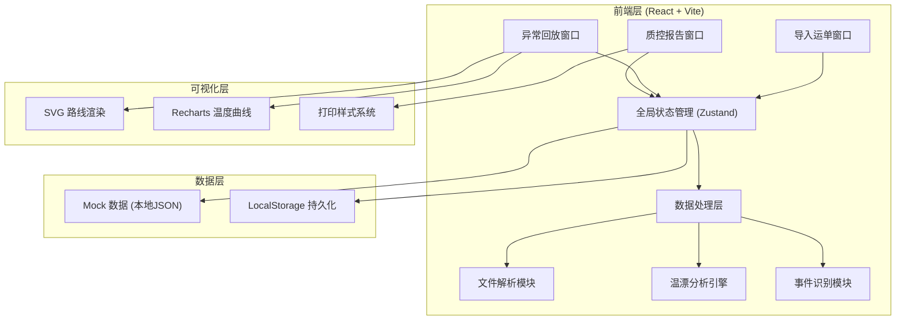
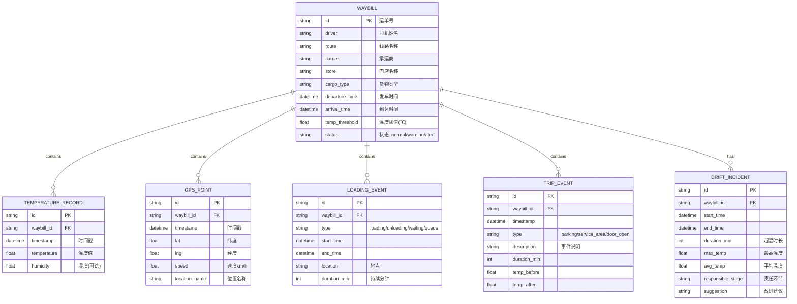

# 冷链质控路线温漂复盘系统 - 技术架构文档

## 1. 架构设计



## 2. 技术说明

- **前端框架**：React@18 + TypeScript + Vite@5
- **样式方案**：TailwindCSS@3 + CSS Variables 主题系统
- **状态管理**：Zustand（轻量级，适合桌面端复杂状态）
- **图表可视化**：Recharts（温度曲线图）+ 原生 SVG（路线图）
- **文件解析**：PapaParse（CSV 解析）+ 原生 FileReader API
- **图标库**：Lucide React（线性图标，符合设计规范）
- **日期处理**：dayjs（轻量级日期格式化与计算）
- **数据存储**：LocalStorage + 内置 Mock 数据（无需后端）
- **打印方案**：原生 window.print() + CSS @media print

## 3. 路由定义

| 路由 | 用途 |
|------|------|
| /import | 导入运单窗口 - 文件拖拽与运单列表 |
| /playback | 异常回放窗口 - 路线+温度同步播放 |
| /report | 质控报告窗口 - 筛选与温漂清单 |

## 4. 数据模型

### 4.1 数据模型定义



### 4.2 核心数据结构 (TypeScript)

```typescript
// 运单
interface Waybill {
  id: string;
  driver: string;
  route: string;
  carrier: string;
  store: string;
  cargoType: string;
  departureTime: string;
  arrivalTime: string;
  tempThreshold: number;
  status: 'normal' | 'warning' | 'alert';
  temperatureRecords: TemperatureRecord[];
  gpsPoints: GpsPoint[];
  loadingEvents: LoadingEvent[];
  tripEvents: TripEvent[];
  driftIncidents: DriftIncident[];
}

// 温度记录
interface TemperatureRecord {
  timestamp: string;
  temperature: number;
}

// GPS 点
interface GpsPoint {
  timestamp: string;
  lat: number;
  lng: number;
  speed: number;
  locationName: string;
  x: number; // SVG 坐标
  y: number;
}

// 装卸事件
interface LoadingEvent {
  type: 'loading' | 'unloading' | 'waiting' | 'queue';
  startTime: string;
  endTime: string;
  location: string;
  durationMin: number;
}

// 行程事件
interface TripEvent {
  timestamp: string;
  type: 'parking' | 'service_area' | 'door_open' | 'traffic_jam';
  description: string;
  durationMin: number;
  tempBefore: number;
  tempAfter: number;
}

// 温漂事件
interface DriftIncident {
  id: string;
  waybillId: string;
  startTime: string;
  endTime: string;
  durationMin: number;
  maxTemp: number;
  avgTemp: number;
  responsibleStage: '装货等待' | '途中停车' | '临近卸货排队' | '其他';
  suggestion: string;
}
```

## 5. 模块划分

```
src/
├── components/
│   ├── layout/           # 布局组件（顶部导航、标签页切换）
│   ├── import/           # 导入窗口组件
│   │   ├── FileDropZone.tsx
│   │   ├── WaybillTable.tsx
│   │   └── Timeline.tsx
│   ├── playback/         # 回放窗口组件
│   │   ├── RouteMap.tsx
│   │   ├── TemperatureChart.tsx
│   │   ├── PlaybackControls.tsx
│   │   └── EventPanel.tsx
│   └── report/           # 报告窗口组件
│       ├── FilterBar.tsx
│       ├── DriftTable.tsx
│       └── PrintPreview.tsx
├── store/
│   └── useWaybillStore.ts    # Zustand 全局状态
├── utils/
│   ├── fileParser.ts         # CSV/GPS 文件解析
│   ├── driftAnalyzer.ts      # 温漂分析算法
│   ├── eventDetector.ts      # 关键节点识别
│   └── mockData.ts           # 模拟数据
├── types/
│   └── index.ts              # TypeScript 类型定义
├── styles/
│   └── print.css             # 打印样式
├── App.tsx
├── main.tsx
└── index.css
```

## 6. 核心算法说明

### 6.1 温漂检测算法
- 滑动窗口：以 5 分钟为窗口扫描温度序列
- 触发条件：连续 3 个采样点温度超过阈值 + 0.5℃
- 严重度分级：超温 <2℃=预警，2-5℃=异常，>5℃=严重
- 合并策略：相邻超温间隔 <10 分钟则合并为同一事件

### 6.2 关键节点识别
- 装货等待：发车前持续 15 分钟以上速度=0 且温度波动
- 途中停车：行驶中速度=0 超过 5 分钟，位置匹配服务区/停车场
- 卸货排队：到达终点前 1km 内速度<5km/h 超过 10 分钟

### 6.3 责任环节判定
- 装货阶段异常 → 责任环节：装货等待
- 行驶中停车后升温 → 责任环节：途中停车
- 临近终点异常 → 责任环节：临近卸货排队
- 其他情况 → 责任环节：设备/其他
